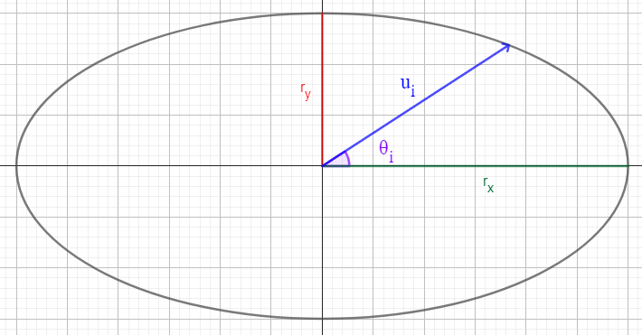

# Ángulo

Un ángulo es un arco de circunferencia dibujado entre dos puntos de origen y destino, y un punto de pivote que servirá como centro de la rotación.

Los ángulos se dibujan como polígonos irregulares abiertos. Se debe escoger un valor de precisión $Z$ para el dibujo, que se corresponde con el número de lados del polígono, por defecto es 16. Entre mayor la precisión, más suave será la curva generada a costa de un mayor tiempo de dibujo.

Sea $P_i$ cada uno de los puntos del polígono tal que $0 \leq i \lt Z$. El ángulo se dibuja como el polígono formado por los puntos $P_0, P_1, \ldots, P_Z$.

Las coordenadas de cada punto describirán una curva elíptica, de modo que pueda redimensionarse vertical u horizontalmente de manera independiente, siguiendo las reglas del sistema de coordenadas de salida (leer [5. Transformación de sistemas de coordenadas](../../model/index.md)).

Los parámetros del ángulo son los siguientes:

- $A$: punto de origen del ángulo.
- $B$: punto de destino del ángulo.
- $V$: punto de pivote del ángulo, o centro de la rotación.
- $r$: radio del ángulo.

## 1. Transformación de los radios
El ángulo se define usando un radio $r$ como un arco de circunferencia. Sin embargo, el sistema de coordenadas de salida puede tener escalas diferentes en cada eje, por lo que el radio debe transformarse para que se ajuste a dicha escala.

Para ello, se debe convertir el valor del radio $r$ a coordenadas de salida para cada eje, de la siguiente forma:

$$
\begin{split}
r_x & = S_x(0) - S_x(r) \\
r_y & = S_y(1) - S_y(r)
\end{split}
$$
Donde $S_x$ y $S_y$ son las funciones de transformación de los ejes $x$ e $y$ del sistema de coordenadas de salida, y $r_x$ y $r_y$ son los radios transformados para cada eje.

De esta manera, el arco de circunferencia que representa el ángulo se vería transformado como un arco de elipse con radios $r_x$ y $r_y$.

_Figura 1. Representación del punto $P_i$ de la curva elíptica._
&nbsp;

## 2. Cálculo de los puntos del polígono

Sea $\alpha$ el ángulo formado entre $V$ y $A$, y $\beta$ el ángulo formado entre $V$ y $B$. Para cada $i$, debe calcularse el ángulo $\theta_i$ interpolando entre $\alpha$ y $\beta$ con alguna estrategia descrita en el modelo matemático, utilizando el valor de $i/Z$ como factor de interpolación.

Una vez obtenido $\theta_i$, las coordenadas del punto $P_i$ se calculan de la siguiente manera.

Partiendo de la ecuación general de una elipse
$$
\frac{x^2}{a^2} + \frac{y^2}{b^2} = 1
$$

Donde $a$ y $b$ son los radios de la elipse, reemplazando por los radios transformados $r_x$ y $r_y$:

$$
\frac{x^2}{r_x^2} + \frac{y^2}{r_y^2} = 1
$$

Donde $x$ y $y$ pueden describirse en términos de un vector de ángulo $\theta_i$ y módulo $u_i$, reemplazando:

$$
\frac{u_i^2 \cos^2 \theta_i}{r_x^2} + \frac{u_i^2 \sin^2 \theta_i}{r_y^2} = 1
$$

Despejando $u$, se obtiene:

$$
u_i^2\left(\frac{cos\theta_i}{r_x^2} + \frac{sin\theta_i}{r_y^2}\right) = 1
$$

$$
u_i = \frac{1}{\sqrt{\frac{cos\theta_i}{r_x^2} + \frac{sin\theta_i}{r_y^2}}}
$$

Nótese que $\theta_i$, $r_x$ y $r_y$ son valores conocidos para cada $i$.

De esta manera, cada punto $P_i$ se puede calcular descomponiendo el vector de ángulo $\theta_i$ y módulo $u_i$ en coordenadas cartesianas, y desplazando el resultado al punto de pivote $V$, de la siguiente forma:

$$
P_i = V + \begin{pmatrix} u_i \cos \theta_i \\ u_i \sin \theta_i \end{pmatrix}
$$

Si del arco del ángulo debe dibujarse solo el borde, entonces se dibujará como un polígono abierto con los puntos antes calculados. En caso de necesitar rellenar el ángulo, se debe dibujar un polígono cerrado, conectando el último punto con $V$.