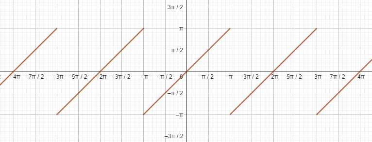

# Modelo matemático

## 1. Cambio de estados simple
El modelo del sistema requiere una estrategia para transicionar valores numéricos de un estado inicial ($x_1$) a un estado final ($x_2$), conociendo el valor de dichos estados y el tiempo requerido para transitar entre ellos ($t_{max}$). Para ello, se utilizará como base una interpolación lineal, de la forma:

$$
x(t) = x_1 + t \frac{x_2 - x_1}{t_{max}}
$$

donde $t$ es el tiempo transcurrido desde el inicio de la transición.

## 1.2. Estados posteriores al final
No todos los elementos necesariamente deben llegar a su estado final en el mismo instante del tiempo. Algunos pueden completarse antes que otros, a partir de lo cual comenzarían a recibir valores $t \gt t_{max}$, por lo que debe definirse un comportamiento adicional para esos casos, pues la interpolación por sí misma generaría valores no deseados. Con este objetivo, se seleccionará una de las siguientes estrategias propuestas:

### 1.2.1. Detener el valor en el estado final (stop)
Para eso, se reemplazará la variable $t$ en el modelo por lo siguiente:

$$
x(t) = x_1 + \min(t, t_{max}) \frac{x_2 - x_1}{t_{max}}
$$

<em>Figura 1. Interpolación deteniendo el estado final.</em>

&nbsp;

Evitando que el valor de entrada de la interpolación sea mayor que el tiempo máximo de transición.

### 1.2.2. Reiniciar el valor al estado inicial (restart)
Para eso, se aplicará el operador módulo a la variable $t$:

$$
x(t) = x_1 + \left(t \mod t_{max}\right) \frac{x_2 - x_1}{t_{max}}
$$

Esto requiere, además, definir la operación módulo para números reales, propuesta de la siguiente forma:

$$
a \mod b = a - b \left\lfloor \frac{a}{b} \right\rfloor
$$

<em>Figura 2. Interpolación repitiendo el cambio de estados.</em>

&nbsp;

### 1.2.3. Regresar al estado inicial (reverse)
Lo que implica que, una vez alcanzado el valor final, se debe regresar al valor inicial moviéndose en sentido contrario. Para ello, lo primero que se hará es ubicar el valor ingresado del tiempo ($t$) en un múltiplo de $t_{max}$, de la siguiente forma:

$$
c = \left\lfloor \frac{t}{t_{max}} \right\rfloor
$$

<em>Figura 3. Interpolación en sentido contrario según la ubicación en el tiempo</em>

&nbsp;

Luego, se determinará si el valor de $c$ es par o impar, para determinar el sentido de la transición.

- Si $c$ es par, significa que el valor de $t$ se encuentra en un intervalo de tiempo en el que el valor de la variable se está acercando al valor final. Por lo tanto, se debe aplicar la interpolación normal, como se describió en los casos anteriores.

- Si $c$ es impar, significa que el valor de $t$ se encuentra en un intervalo de tiempo en el que el valor de la variable ha terminado su cambio de estados y ahora va regresando al valor inicial. Esto implica invertir el sentido de la interpolación.

Con esto, se obtiene el siguiente valor de tiempo ajustado en la dirección correcta:

$$
t' = \begin{cases}
t \mod t_{max} & \text{si } c \text{ es par} \\
t_{max} - \left(t \mod t_{max}\right) & \text{si } c \text{ es impar}
\end{cases}
$$

Finalmente, se aplica la ecuación de interpolación lineal con el valor de tiempo ajustado:

$$
x(t) = x_1 + t' \frac{x_2 - x_1}{t_{max}}
$$

Cualquiera de las tres estrategias descritas anteriormente puede ser utilizada para la transición de estados, y su elección depende totalmente del resultado que se desee obtener.

## 1.3. Transición no lineal
En ocasiones puede ser necesario que la transición de estados no sea lineal, sino que cambie describiendo otro tipo de de curva, por ejemplo, para crear un efecto de suavizado o de aceleración. Para lograr esto de forma sencilla, se realizará el siguiente procedimiento:

- Normalizar los valores de la interpolación dentro del rango $[0, 1]$.
- Aplicar una función de transformación (según se requiera) a los valores normalizados, que genere también valores dentro del mismo rango.
- Desnormalizar los resultados de la transformación, para regresarlos al rango original y obtener el resultado final.

Lo anterior se describe de la siguiente manera:

$$
x'(t) = x_1 + F\left( \frac{x(t) - x_1}{x_2 - x_1} \right) \left(x_2 - x_1\right)
$$

Donde $F(x)$ es la función de transformación, e idealmente debe cumplir las siguientes condiciones:

- La salida de la función debe mantenerse dentro del rango de la normalización, es decir que: $0 \le x \le 1 \implies 0 \le F(x) \le 1$.

- La función debe ser continua, es decir, sin saltos abruptos o puntos indefinidos entre los valores de salida.

- Los estados inicial y final se conservan, es decir que: $F(0) = 0$ y $F(1) = 1$.

No es requisito que estas condiciones se cumplan para que el sistema _funcione_, pero el no cumpliras implicará que se generen valores intermedios no deseados durante la transición.

Con base en lo anterior, a continuación se construirán algunas funciones de transformación que pueden ser utilizada para generar comportamientos comunes en las transiciones de estados.

### 1.3.1. Sin transformación (lineal)
La función base $F(x)$ en la que no ocurre ninguna transformación a los resultados de la interpolación es:

$$
F(x) = x
$$

Visualmente, esta es una representación de un movimiento con velocidad constante.

### 1.3.2. Aceleración constante (accel1)
En este comportamiento, el valor irá incrementando su velocidad de cambio hasta alcanzar una velocidad máxima al final del tiempo de transición. La velocidad inicial del movimiento ($v_0$) es un parámetro de la función, y la velocidad máxima ($v_{max}$) se debe calcular automáticamente.

El modelo se construirá con base en la ecuación general para el movimiento rectilíneo uniformemente acelerado [1]:

$$
F(x) =  v_0 x + \frac{1}{2} a x^2
$$

De esta ecuación, se conoce que $F(0)=0$ y $F(1)=1$ pues los valores de entrada para la función de transformación ya están normalizados. Asimismo, el valor de $v_0$ es una constante, por lo que se puede obtener la aceleración $a$ de la siguiente manera:

$$
\begin{split}
1 - v_0 & = \frac{1}{2} a \\
a & = 2 (1-v_0)
\end{split}
$$

Reemplazando:

$$
\begin{split}
F(x) & = v_0 x + (1-v_0) x^2 \\
\end{split}
$$

La siguiente gráfica ilustra el comportamiento de la función de transformación, en función de el valor normalizado de $x$.

<em>Figura 4. Función de transformación para aceleración constante</em>

&nbsp;

Sin embargo, hay que notar que para esta ecuación, el valor de velocidad $v_0$ debe usar también unidades normalizadas, considerando que el cambio de valor va de $0$ a $1$ en el tiempo de transición. Si se desea usar la velocidad con las mismas unidades que el valor de la variable por unidad de tiempo, se debe normalizar también el valor de $v_0$:

$$
v_0 = \frac{v_0'}{x_2 - x_1}
$$

Donde $v_0'$ es la velocidad en las unidades originales de la variable.

### 1.3.3. Aceleración y desaceleración simétricas (accel2)
En este comportamiento, la velocidad irá aumentando hasta alcanzar su valor máximo en la mitad del recorrido ($x=0.5$), luego comenzará a desacelerar hasta llegar al valor final. Como en el caso anterior, la velocidad inicial del movimiento ($v_0$) es un parámetro de la función, y la velocidad máxima ($v_{max}$) se debe calcular automáticamente.

Este modelo se puede construir utilizando el anterior (1.3.2) como referencia, escalando la curva de la función de transformación a la mitad para la primera mitad del trayecto ($F_1(x)$), y luego aplicando una traslación para la segunda mitad ($F_2(x)$).

Para la primera mitad del trayecto, la función de transformación se construye de la siguiente manera:

- Dividir entre dos el valor de salida, para que el máximo sea $0.5$.
- Multiplicar por dos el valor de entrada, para que el máximo esté en $x=0.5$.

Resultando en:

$$
\begin{split}
F_1(x) & = \frac{1}{2} \left(2v_0x + (1-v_0)(2x)^2\right) \text{, } 0 \leq x \leq 0.5 \\
F_1(x) & = v_0x + 2(1-v_0)x^2 \text{, } 0 \leq x \leq 0.5
\end{split}
$$

Para la segunda mitad, debe encontrarse una curva parabólica tal que:

- Coincida con la curva anterior en la mitad del recorrido, es decir que $F_2(0.5) = 0.5$.
- Su valor final sea $F_2(1) = 1$.
- Su velocidad final sea igual a la velocidad inicial, es decir que $\frac{dF_2}{dx}(1) = v_0$.

Partiendo de la forma general para ecuaciones de segundo grado:

$$
\begin{split}
F_2(x) & = ax^2 + bx + c \\
\frac{dF_2}{dx}(x) & = 2ax + b
\end{split}
$$

Se pueden usar las anteriores reglas para obtener el siguiente sistema de ecuaciones:

$$
\begin{split}
\frac{1}{4}a + \frac{1}{2}b + c & = \frac{1}{2} \\
a + b + c & = 1 \\
2a + b & = v_0 \\
\end{split}
$$

Resolviendo, se obtienen los coeficientes de la función de transformación:

$$
\begin{split}
a & = 2v_0 - 2 \\
b & = 4 - 3v_0 \\
c & = v_0 - 1
\end{split}
$$

Con lo cual, la función de transformación para la segunda mitad del trayecto es:

$$
F_2(x) = (2v_0 - 2)x^2 + (4 - 3v_0)x + v_0 - 1
$$

Uniendo ambas funciones, se obtiene la función de transformación completa:

$$
F(x) = 
\begin{cases}
  v_0x + 2(1-v_0)x^2 , & \text{si } 0 \leq x \leq 0.5 \\
  (2v_0 - 2)x^2 + (4 - 3v_0)x + v_0 - 1, & \text{si } 0.5 \lt x \leq 1
\end{cases}
$$

El comportamiento de este modelo se puede apreciar en la siguiente gráfica:

<em>Figura 5. Función de transformación para aceleración y desaceleración simétricas</em>

## 2. Cambio de estados compuesto
En ocasiones, una transición puede no estar conformada solo por un estado inicial y uno final, sino por una secuencia de $n$ estados intermedios ($x_i$, con $0 \leq i \lt n$), como se puede apreciar en la siguiente figura:

<em>Figura 6. Ejemplo de transición compuesta</em>

&nbsp;

Cada estado $i$ tiene su propio valor de tiempo final ($t_i$), el cual es **relativo** al valor del tiempo final anterior.

El tiempo total de la transición es la suma de los tiempos de todos los estados, descrito como:

$$
t_{max} = \sum_{i=0}^{n-1} t_i
$$

Para tratar con estados compuestos, lo primero que debe hacerse es ubicar en cuál estado intermedio (o _subestado_) se encuentra el valor de tiempo ingresado. Para ello, deben recorrerse todos los subestados hasta encontrar uno tal que $t_i \le t \lt t_{i+1}$.

Una vez ubicado el subestado, se aplicará una interpolación lineal y alguna de las técnicas descritas en la sección 1.3 normalmente, pero ajustando el valor del tiempo para dejarlo relativo al subestado actual. Es decir:

$$
t' = t - \sum_{j=0}^{i-1} t_j
$$

Con este ajuste realizado, el estado compuesto en su totalidad puede tratarse como un estado simple, y se le pueden aplicar cualquiera de las técnicas de estados posteriores al final descritas en 1.2.

## 3. Cambio de estados vectorial

Algunas propiedades deben definirse como vectores de varios valores en lugar de uno solo, como la posición o el color. Para estos casos, la declaración de estados inicial y final se realiza de la siguiente forma:

$$
X_1 = \begin{pmatrix}
x_{11} & x_{12} & \dots & x_{1n}
\end{pmatrix} \\
X_2 = \begin{pmatrix}
x_{21} & x_{22} & \dots & x_{2n}
\end{pmatrix}
$$

Donde $X_1$ es el estado inicial, $X_2$ es el estado final, y $x_{ij}$ es el valor $j$ del vector $X_i$.

Para transicionar entre estos estados, se aplicarán los mismos procedimientos definidos anteriormente, uno por cada componente del vector.

### 3.1. Caso particular: rotación de vectores $\mathbb{R}^2$
Los vectores con dos componentes se pueden utilizar para representar posiciones (puntos). Como una de las funcionalidades planteadas para el proyecto, debe plantearse el siguiente escenario:

- Se tiene un punto inicial $P_1=\begin{pmatrix}x_1 & y_1\end{pmatrix}$.
- Se tiene un punto final $P_2=\begin{pmatrix}x_2 & y_2\end{pmatrix}$.
- Se tiene un punto _pivote_ o eje de rotación $P_v\begin{pmatrix}x_v & y_v\end{pmatrix}$.
- La transición de $P_1$ a $P_2$ debe realizarse rotando el punto $P_1$ alrededor del punto $P_v$, en lugar de moverlo directamente en línea recta.

Para realizar esta transición es necesario obtener el módulo y dirección desde el pivote hasta el punto inicial $(d_1,\theta_1)$, así como el módulo y dirección desde el pivote hasta el punto final $(d_2,\theta_2)$.

En lugar de transicionar directamente las coordenadas $x$ e $y$ de los puntos, se transicionarán los valores de $d$ y $\theta$.

<em>Figura 7. Rotación de vectores</em>

Una vez realizada la interpolación del módulo y ángulo en función del tiempo, deben obtenerse las coordenadas $x$ e $y$ del punto resultante, de la siguiente forma:

$$
\begin{split}
x(t) & = x_v + d(t) \cdot \cos(\theta(t))\\
y(t) & = x_v + d(t) \cdot \sin(\theta(t))
\end{split}
$$

Una vez obtenidas las coordenadas, debe normalizarse el resultado en un range de 0 a 1, para que pueda ser una salida válida como función de transformación, de la siguiente manera:

$$
\begin{split}
x'(t) & = \frac{x(t) - x_{1}}{x_{2} - x_{1}}\\
y'(t) & = \frac{y(t) - y_{1}}{y_{2} - y_{1}}
\end{split}
$$

## 4. Transformaciones de ángulos
Aplicar interpolaciones a valores numéricos que representan ángulos conlleva una complejidad adicional. Al ser valores cíclicos, la transición podría generar resultados intermedios indeseados. Por ejemplo, si el estado inicial es un ángulo de $350°$ y el estado final es un ángulo de $10°$, la interpolación lineal entre recorrería el trayecto más largo, pasando por $180°$.

Para corregir esto, se propone la siguiente estrategia:

- Normalizar los ángulos a un rango de $0°$ a $360°$.
- Normalizar los ángulos a un rango de $-180°$ a $180°$.
- Calcular la distancia entre ángulos para cada una de las normalizaciones.
- Se seleccionarán los valores normalizados que generen la menor distancia entre ángulos.
- Si lo que se desea es que la transición sea a través del trayecto más corto, se interpolará directamente entre los valores seleccionados.
- Si lo que se desea es que la transición sea a través del trayecto más largo, al valor inicial se le sumará  $360°$ antes de realizar la interpolación.
- Al resultado de la interpolación, se le aplicará una de las normalizaciones.

### 4.1. Normalización de ángulos
A continuación se describe un modelo para normalizar ángulos.

### 4.1.1. Normalización a rango de $0°$ a $360°$
Utilizando la operación módulo, se puede ajustar el valor del ángulo $\theta$ a un rango de $-360°$ a $360°$ de la siguiente forma:

$$
\theta_{360°} = \theta \mod 360°
$$

A esta cantidad se le puede sumar $360°$ para asegurar que el resultado es positivo:

$$
\theta_{360°} = 360° + (\theta \mod 360°)
$$

Y finalmente, se vuelve a aplicar el módulo para asegurar que el resultado está en el rango de $0°$ a $360°$:

$$
\theta_{360°} = (360° + (\theta \mod 360°))\mod 360°
$$

<em>Figura 8. Normalización a rango de 0° a 360°</em>

### 4.1.2. Normalización a rango de $-180°$ a $180°$

Para normalizar el ángulo a un rango de $-180°$ a $180°$, se puede trasladar el ángulo $180°$, aplicar la normalización anterior, y finalmente trasladar el resultado $180°$ en sentido contrario:

$$
\theta_{180°} = (\theta + 180°)_{360°} - 180°
$$

<em>Figura 9. Normalización a rango de -180° a 180°</em>

### 4.2. Selección del formato de normalización

Dados dos ángulos $\alpha$ y $\beta$ entre los cuales se desea realizar la interpolación, debe seleccionarse la normalización que genere la menor distancia entre los ángulos.

Sea $f(\theta)$ la función que calcula la normalización de un ángulo $\theta$ en un formato determinado, entonces:

$$
\begin{split}
d_{360°} & = |\beta_{360°} - \alpha_{360°}| \\
d_{180°} & = |\beta_{180°} - \alpha_{180°}|
\end{split}
$$

$$
f(\theta) = \begin{cases}
  \theta_{360°} & \text{si } d_{360°} < d_{180°}\\
  \theta_{180°} & \text{si } d_{360°} \geq d_{180°}
\end{cases}
$$

### 4.3. Interpolación de ángulos

Una vez seleccionado el formato de normalización, se puede realizar la interpolación de ángulos dependiendo de si se desea que la transición sea a través del trayecto más corto o el más largo.

Para el caso de la interpolación a través del trayecto más corto, basta con interpolar desde el valor de $f(\alpha)$ hasta el valor de $f(\beta)$ con alguna de las estrategias descritas en secciones anteriores.

Si lo que se desea es interpolar a través del trayecto más largo, debe hacerse desde el valor de $f(\alpha)+360°$ hasta el valor de $f(\beta)$.

## 5. Transformación de sistemas de coordenadas

Muchas de las propiedades de los elementos tratan con coordenadas cartesianas $(x,y)$ que, por cuestiones de simplicidad, son definidas sobre un sistema de coordenadas simplificado. Sin embargo, al momento de generar la animación de salida, será necesario transformar todas las coordenadas a otro sistema, por ejemplo, uno basado en pixeles.

Para ello, se plantea el siguiente modelo:

- Sean $(x,y)$ las coordenadas en el sistema simplificado.
- Sean $(S_x(x),S_y(y))$ las coordenadas en el sistema de salida.
- Para el sistema de salida, se determinan unas dimensiones $(w, h)$, representando ancho y alto, respectivamente.
- Para el sistema de salida, se determina un origen $(O_x, O_y)$ **relativo** a las dimensiones del mismo. Es decir, si el origen es $(0.5, 0.5)$, significa que el origen está en el centro del sistema de salida.
- Sea $(U_x, U_y)$ el valor de equivalencia entre las unidades del sistema de entrada y salida. Es decir, si el valor de $U_x$ es $100$, significa que cada unidad en el sistema simplificado equivale a $100$ unidades en el sistema de salida.
- Sea $(K_x, K_y)$ el factor de escala para cada eje; puede considerarse como un multiplicador adicional en los valores de $U_x$ y $U_y$.

Entonces, la transformación de coordenadas se formula de la siguiente manera:

$$
\begin{split}
S_x(x) & = w O_x + U_x K_x x \\
S_y(y) & = h O_y + U_y K_y y
\end{split}
$$

Los parámetros del sistema de coordenadas también pueden describir una transición animada, por lo que un mismo valor $(x,y)$ en el sistema de entrada puede generar diferentes salidas en función del tiempo: $(S_x(x, t),S_y(x, t))$.

Por lo general, el eje vertical en una pantalla digital se orienta hacia abajo mientras que en un plano cartesiano se orienta hacia arriba. Por esta razón, se recomienda que el valor de $K_y$ sea negativo.